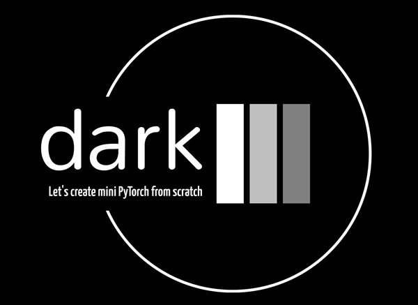

# Dark - a PyTorch like library written from scratch (for education)


## Modules

1) **dark-1** 
Core elements: graph nodes, auto-diff engine for scalars only.   
<ins>Sample</ins>: quadratic 1D function optimization
[Medium article 1 - TODO]() 
[Medium article 2 - TODO]() 
   
1) **dark-2**
Support for tensor objects.    
<ins>Sample</ins>: logistic regression on 2D data.
[Medium article - TODO]() 
   
1) **dark-3**
Implementation of higher-level classes: Module, Linear and ReLU layers and BCEWithLogits / CrossEntropy loss. SGD optimizer.     
<ins>Sample</ins>: MNIST classification (without dataloader)
[Medium article - TODO]() 
   
1) **dark-4**
Implementation of Dataset, DataLoader and transformation classes.    
<ins>Sample</ins>: FashionMNIST classification - in a PyTorch style!
[Medium article - TODO]() 

1) **dark-5** (TODO)
Implementation of Conv2D and MaxPool layers    
<ins>Sample</ins>: CIFAR10 classification using CNN.
[Medium article 1 - TODO]() 
[Medium article 2 - TODO]() 

1) **dark-6** (TODO)
GPU support via CuPy    
<ins>Sample</ins>: cat/dog classification using Resent9 written from scratch
[Medium article - TODO]() 


## How to run
To run samples go to a module folder and install a package by running:
```
pip install --editable .
```

E.g.
```
cd dark-1
pip install --editable .
code .
```

All required packages should be installed automatically.
Note: it is recommended to create an environment first.
