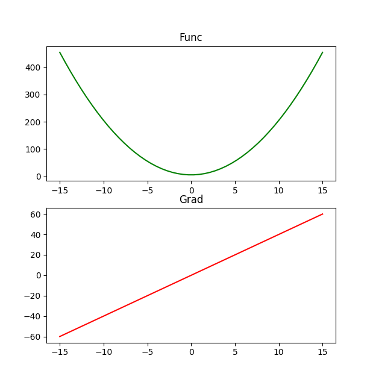
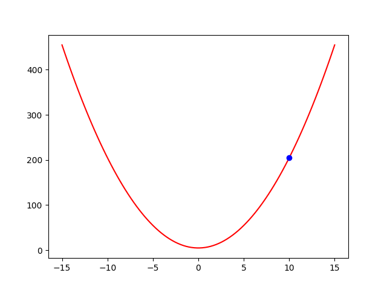

# Dark - Let's create mini PyTorch from scratch (tutorial)


*Have you ever wondered how PyTorch works in depth? If the answer is positive and you have a moderate knowledge of PyTorch (because we are going into depth) - the this tutorial and series of articles is for you.*

We start gently by introducing the concept of derivation, then move on to function optimization. From there, we build our first neural network, followed by convolutional neural networks for classification, regression, segmentation, and image generation. Finally, we conclude with object detection - YOLO.

This tutorial is created to reveal and recreate the internal workings of the famous PyTorch framework by following the principles:
1) A moderate knowledge of PyTorch framework is assumed.
2) Concepts are introduced step by step with samples.
3) The focus is placed on computer vision samples.
4) Sample datasets are chosen to provide fast training with acceptable results. 
5) Significant effort is put on code simplicity and readability.

## Modules

### Dark-0
<table>
    <tbody>
        <tr>
            <td>articles</td>
            <td><a href="https://medium.com/@darko-juric/mini-pytorch-from-scratch-module-0-d5d58e917351"> All parts </a> </td>
        </tr>
        <tr>
            <td>keywords</td>
            <td>derivation, gradient</td>
        </tr>
        <tr>
            <td>description</td>
            <td>Introduction of a fundamental construct - derivation, why is it important, and how derivative is taken from complex functions.</td>
        </tr>
        <tr>
            <td>samples</td>
            <td align="center">-</td>
        </tr>
    </tbody>
</table>

### Dark-1
<table>
    <tbody>
        <tr>
            <td>articles</td>
            <td>
                <a href="https://medium.com/@darko-juric/mini-pytorch-from-scratch-module-1-part-1-63376eb56bb6"> Part 1 </a> <br/>
                <a href="https://medium.com/@darko-juric/mini-pytorch-from-scratch-module-1-part-2-2dbad2a2d54e"> Part 2 </a>
            </td>
        </tr>
        <tr>
            <td>keywords</td>
            <td>execution graph, auto-differentiation</td>
        </tr>
        <tr>
            <td>description</td>
            <td>There will be two parts: We will extend the basis by taking a derivative of a complex function in a way PyTorch does it. For that we will introduce execution graph and auto-differentiation. Finally, in the second part, we will make out first framework for function minimization which supports scalars.</td>
        </tr>
        <tr>
            <td>samples</td>
            <td align="center">
                <div>
                
                
                </div>
                <span>Left: derivation of a function. Right: minimization of the same function.</span>
            </td>
        </tr>
    </tbody>
</table>
  
### Dark-2
<table>
    <tbody>
        <tr>
            <td>articles</td>
            <td>
                <a href="https://medium.com/@darko-juric/mini-pytorch-from-scratch-module-2-c6f418f10cbf"> All parts </a> <br/>
            </td>
        </tr>
        <tr>
            <td>keywords</td>
            <td>tensor, logistic regression, loss function</td>
        </tr>
        <tr>
            <td>description</td>
            <td>The framework will be extended to work on multi dimensional arrays (tensors). We will conclude with logistic regression which will also introduce loss function.</td>
        </tr>
        <tr>
            <td>samples</td>
            <td align="center">
                <div>
                
                </div>
                <span>Fitting logistic plane to 2D points.</span>
            </td>
        </tr>
    </tbody>
</table>

### Dark-3
<table>
    <tbody>
        <tr>
            <td>articles</td>
            <td>scheduled for 06/02/2024</td>
        </tr>
        <tr>
            <td>keywords</td>
            <td>modules, Module class</td>
        </tr>
        <tr>
            <td>description</td>
            <td>Logistic regression will be rewritten in a PyTorch style. For that we need to introduce Module - a basic higher-order building block. Loss function and optimization algorithms will be placed into their respective places. We will conclude with simple NN regression on 2D data.</td>
        </tr>
        <tr>
            <td>samples</td>
            <td align="center">
                <div>
                
                </div>
                <span>Training of a NN to approximate 3D function.</span>
            </td>
        </tr>
    </tbody>
</table>

### Dark-4
<table>
    <tbody>
        <tr>
            <td>articles</td>
            <td>scheduled for 09/02/2024</td>
        </tr>
        <tr>
            <td>keywords</td>
            <td>Dataset, DataLoader and transformation classes</td>
        </tr>
        <tr>
            <td>description</td>
            <td>In order for our models to work they need data. Therefore, we will create Dataset - a class describing how a single sample is loaded, DataLoader - a class responsible for data batching and transformation classes - for data augmentation. Sample: clothes classification using NN.</td>
        </tr>
        <tr>
            <td>samples</td>
            <td align="center">
                <div>
                
                </div>
                <span>FashionMNIST classification using NN (green - hit, red - miss).</span>
            </td>
        </tr>
    </tbody>
</table>

### Dark-5
<table>
    <tbody>
        <tr>
            <td>articles</td>
            <td>scheduled for 12/02/2024</td>
        </tr>
        <tr>
            <td>keywords</td>
            <td>GPU, convolution, max pooling, ResNet</td>
        </tr>
        <tr>
            <td>description</td>
            <td>In order to speed up the calculation we will implement support for GPU via CuPy. To work with images we will explain and implement convolution and max pooling layers (for CPU and GPU). Moreover, batch normalization and dropout will be implemented and explained. Finally, ResNet based classification and regression samples will follow.</td>
        </tr>
        <tr>
            <td>samples</td>
            <td align="center">
                <div>
                
                
                </div>
                <span>Left: CIFAR10 classification using Resnet. Right: ResNet training forface landmark detection (epochs 1–7).</span>
            </td>
        </tr>
    </tbody>
</table>

### Dark-6
<table>
    <tbody>
        <tr>
            <td>articles</td>
            <td>scheduled for 15/02/2024</td>
        </tr>
        <tr>
            <td>keywords</td>
            <td>transposed convolution, upsampling layers; UNet; GAN</td>
        </tr>
        <tr>
            <td>description</td>
            <td>Image to image translation (e.g. autoencoders) require image upsampling opposed to convolution and max-pooling which usually reduce image size. Therefore, transposed convolution and upsample layers will be introduced and implemented. Demonstration will be made by UNet-based car segmentation and anime generation via GAN (written from scratch).</td>
        </tr>
        <tr>
            <td>samples</td>
            <td align="center">
                <div>
                
                
                </div>
                <span>Left: GAN training on anime faces (epochs 1–13). Right: Object segmentation using UNet.</span>
            </td>
        </tr>
    </tbody>
</table>

### Dark-7
<table>
    <tbody>
        <tr>
            <td>articles</td>
            <td>scheduled for 17/02/2024</td>
        </tr>
        <tr>
            <td>keywords</td>
            <td>object detection, YOLO</td>
        </tr>
        <tr>
            <td>description</td>
            <td>In order to show we support SOTA algorithms, a object detection algorithm - YOLO will be created from scratch with a custom lightweight backbone for face detection.</td>
        </tr>
        <tr>
            <td>samples</td>
            <td align="center">
                <div>
                
                </div>
                <span>Training YOLO detector for face detection. (Epochs 1–7)</span>
            </td>
        </tr>
    </tbody>
</table>


## Setup

It is highly recomended to create a new environment (**Python 3.11** was tested) and install needed dependencies:
```
conda create --name dark python=3.11
conda activate dark
pip install -r requirements.txt
```

If you have CUDA capable card install the following package as well to run operations on GPU (**significant speedup**):
```
pip install cupy==12.3.0
```

You will probably want to compare results and performance with PyTorch. Install it using the instructions on [PyTorch official page](https://pytorch.org/get-started/locally/). 


## Running samples

Each sample, except its own README file, has three folders:
1) dark - code written in Dark
2) torch - code written in PyTorch (for comparison)
3) db - database folder referenced by both dark and torch samples with its own README for instructions for data download and preparation (via included python script). *(included with samples which need data)*


To run samples go to a module folder and install a package by running:
```
pip install --editable .
```

E.g.
```
cd dark-1
pip install --editable .
code .
```

The base path for samples is the root of a module, which means open dark-X folder in VS Code (not samples folder).

All samples and used databases are chosen in a way that training on a reasnobly new GPU will take only several minutes.


### Potential issues
All samples are tested on NVidia GeForce 4070 Mobile which has 8GiB of VRAM. If you get an exception like out of memory, reduce a batch size.   

In addition to that, some drivers treat system RAM and VRAM as a single unit meaning you have "more" VRAM, and if you exceed the size of a phyisical VRAM, you will not get out of memory exception, but the execution speed will suffer even though you are using GPU - keep that in mind.

## Conclusion

I sincerly hope you will learn new things related to PyTorch inner architecture and have fun along the way.

If you are working on something interesting please do not hesitate to reach me out on [LinkedIn](https://www.linkedin.com/in/darko-juric/).


