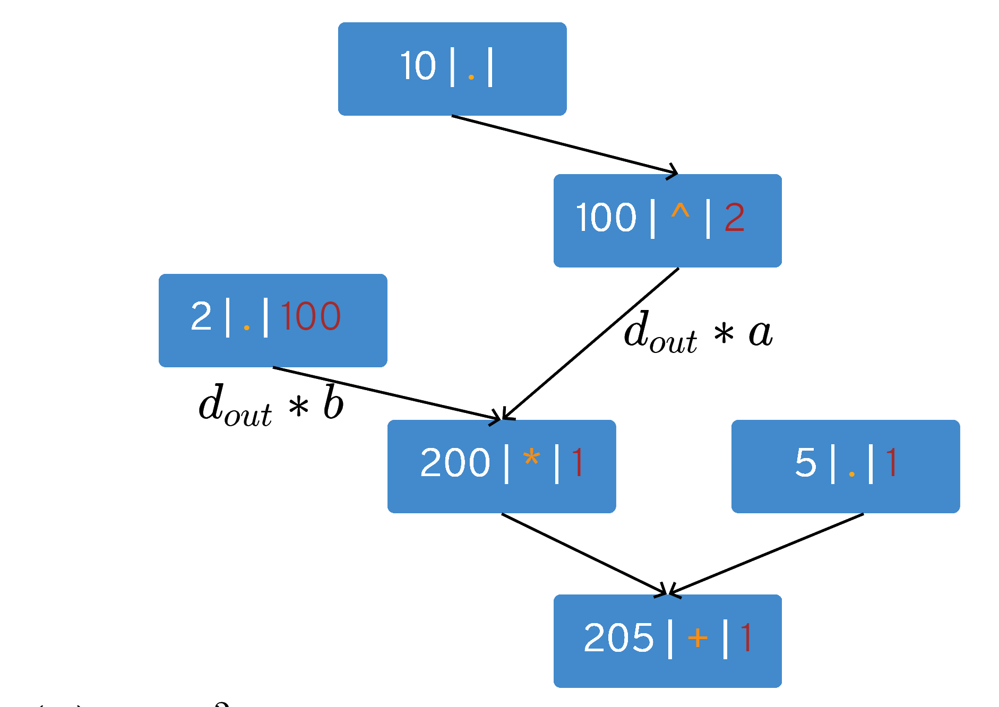

# Module 1

Let us build out own version of PyTorch! 
It will follow principles of auto-differentiation and graph building which is often skip in various NN builds found on the web. Such approach enables us to have an arbitrary complex functions and we do not have to derive partial derivatives ourselves, but it is done automatically.

We can think about PyTorch as an function optimization framework built on tensors. Tensors in PyTorch are nothing more than multidimensional matrices which have an ability to be connected to each other and propagate gradients backward.

In this tutorial we will be constrained to scalars and the support for matrices will follow later. However, the basis will be the same.

## Sample

Let us write a basic sample in PyTorch that uses automatic differentiation and optimization mechanism - 1D function quadratic function optimization:

```python
import torch

x = torch.tensor([10.0], requires_grad=True)

for _ in range(100):
     fx = torch.add(torch.mul(2, torch.pow(x, 2)), 5) #2*x^2 + 5
     fx.backward() #calc gradient

     x.data.sub_(0.1 * x.grad) #optimize
     x.grad.zero_() #zero grad
     
print(x) #0
```

## So what is going on there ?

The sample above has three important parts:
1) objective to optimize - quadratic function
2) gradient calculation
3) optimization

Users of PyTorch will notice the three most important functions: 
1) backward()
2) step() - written as ```value = value - <learning rate> * x.grad```
3) zero_grad()

First, we set our parameter: $x$. As the variable $x$ is the only variable that will be optimized, it is wrapped into tensor object. 
Moreover, all operations that are used are wrapped ones from the torch namespace (we can not mix 3rdParty ones with torch ones). 
The reason behind is that we have to trace variable $x$ to build a graph. 

### What kind of graph are we talking about ?

We are talking  about auto diff graph. 
Let us decompose the function: $f(x) = 2 * x^2 + 5$, for some concrete values e.g. $x = 10$. Each node will display two elements: a value and an operation if a node carries an operation where '.' will signify no operation.


From top down: the input value is 10. The node has no operation. This number is an input to a node which has power of 2 operation and it is displayed in the second row.
Next, in the third row constant 2 enters into play which which is multiplied with the previous node - fourth row. 
Finally, constant 5 is added to everything which creates final node where 205 is shown.

### Going backwards - function 'backward'

According to chain rule $d * f'(x)$, where $d$ is an input from a child node, we can traverse the directed graph backwards to calculate derivatives. Let us show this by using the previous graph and extending it by the third element: a derivation value.


The final node (in the last row) always has derivation value set to 1. The node has an addition operation $x+y$.
Taking partial derivation respective to $x$ we obtain 1 $(\frac{d(x+y)}{dx} = 1 + 0 = 1)$ and using the chain rule the left parent node will have value $1 * 1 = 1$. The same goes fo the right parent node.


Next, we have multiplication operation $x*y$. Taking derivative in respect to $x$ we have $y$ $(\frac{d(x*y)}{dx} = y)$, while taking derivative in respect to $y$ we obtain $x$, where $x$ and $y$ were input values into the node (2, and 100 respectively). 

Therefore, the parent node on the left receives value $d * y = 1 * 100 = 100$ and the right parent receives $d * x = 1 * 2 = 2$. [TODO - replace a and b with x and y]



The node is the second row has power function which derivative is $(x^2)' = 2 * x$. Therefore to its only parent is sends $d * (2 * x) = 2 * (2 * 10) = 40$ which is the final result.


As it can be seen, by using partial derivatives for simple functions and using the chain rule we can differentiate complex function automatically.


### Optimization step - function 'optimize'

After obtaining a gradient value (in our case 40), we can move parameters $x$ towards the function minimum. We do that simply by moving to the opposite direction ('-' sign) of a gradient by a fraction (0.1) of its value. 


```python
 x.value = x.value - 0.1 * x.grad
```

The next value of $x$ is $10 - 0.1 * 40 = 6$. 

After an optimization step we do not need the gradient anymore and we do not want to accumulate values from previous steps, so we clear all the gradients in all nodes by calling ```zero_grad()```.

Finally, by repeating this procedure many times (in this case 100) we are moving our parameter ($x$) towards the function minimum - in this case 0.


------------
## Implementation

Going back to our sample, let us write the code in our newly (not yet created - 'dark' framework):

```python
import dark

x = dark.Parameter(10)

for _ in range(100):
     fx = dark.add(dark.mul(2, dark.pow(x, 2)), 5) #2*x^2 + 5
     fx.backward() #calc gradient

     x.value = x.value - 0.1 * x.grad #optimize
     x.zero_grad() #zero grad
     
print(x) #0
```

First, we set our parameter: $x$. As the variable $x$ is the only variable that will be optimized, it is wrapped into Parameter object. The reason behind is that we have to trace variable $x$ to build a graph. 

Next, we construct the function using math functions in 'dark' namespace for the same reason.

We can see that the code is nearly identical to our PyTorch version. We do not have overridden operators (for the sake of simplicity), thus we have to call functions explicitly.

### Graph nodes

TODO: image of node hierarchy

1) Node
2) Constant and Parameter
3) Operation

We will have three node types. One for constant values which do not have gradient - *Constant* and one for parameters which are optimized - *Parameter* node. Both node types will be inherited from the base class *Node* which is also used as an internal graph node type - for intermediate function results.


#### Node
Let us start from the base class *Node*. The class encapsulates two elements: operation and input values. It contains its *value* as well as gradient *_grad*.

Besides the values, the node object will have two methods which we have seen and used before: *backward* and *zero_grad*.

Function *backward* will call the most imporant function *_autodiff*. Function *_autodiff* is a recursive function that calls differentiate operation for a node, sets or adds gradient to parent node(s) and repeat the procedure until the root of the graph is reached.

```python
class Node(): #base node type used also as a internal graph node
    op = None #operation
    inputs = [] #input nodes

    value = None
    _grad = None

    def __init__(self, val):
        self.value = val

    def backward(self):
        if self.grad is None:
            self.grad = 1

        self._autodiff()

    def zero_grad(self):
        if self._grad is not None:
            self._grad = 0

        for node in self.inputs:
            node.zero_grad()

    def _autodiff(self): 
        #recursive function that sets or accumulates gradients depending on a node type
        if self.op is not None:
            dldx = self.op.differentiate(self)
            for k, pd in enumerate(dldx):
                self.inputs[k].grad = pd #set (Node) or accumulate (Parameter)
        
        for node in self.inputs:
            node._autodiff()

    @property
    def grad(self):
        return self._grad

    @grad.setter
    def grad(self, value):
        self._grad = value 
```


#### Constant

Node constant does not have a gradient - therefore we override getter and setter function and set gradient to *None*.

```python
class Constant(Node): #constant node does not have gradient

    @property
    def grad(self):
        return None

    @grad.setter
    def grad(self, value):
        pass
```

#### Parameter

Parameter node is a node type created explicitly by user for parameter(s) that we want to optimize. Initially, its gradient is set to zero and opposed to its base class *Node* it accumulates gradient, while *Node* only sets a gradient.

The gradient accumulation is done because *Parameter* can have multiple child nodes and thus gradient is the sum of all gradients going into that node. [TODO: check that fact]

```python
class Parameter(Node): #parameter node which accumulates gradient

    def __init__(self, val):
        super().__init__(val)
        self._grad = 0

    @Node.grad.setter
    def grad(self, value):
        self._grad += value
```

#### Operation

*Operation* object is a member of a *Node* and it has two important functions: *apply* and *differentiate*.

Function *apply* creates a Node, applies an operation and connects node's inputs to a graph being built in such fashion. The end result is built graph. The function is called explicitly by a user.

Function *differentiate* calculates derivative for the node using input(s) *x*, nodes value *y* calculated in the forward pass and a gradient propagated from its child(ren) *dldy*. The function is called by its associated node.

```python
is_training = True #remember the input values only if we are in training mode

class Operation():

    @classmethod
    def apply(op, *inputs, **kwargs):
        #propagate calculated values forward

        #convert numbers into constant node type
        inputs = list(inputs)
        for k, n in enumerate(inputs):
            if isinstance(n, Node): continue
            inputs[k] = Constant(n)

        x = [n.value for n in inputs]
        y = op._f(*x, **kwargs)

        out_node = Node(y)
        if is_training: #remember inputs and op only if we are training
            out_node.op = op
            out_node.inputs = inputs
        
        return out_node

    @classmethod
    def differentiate(op, node):
        #get inputs and calculate gradient for parent node(s)

        dldy = node.grad
        x = [n.value for n in node.inputs]
        y = node.value

        result = op._df(dldy, y, *x)
        return result

    @staticmethod
    def _f(x):
        #calc function value
        raise Exception("Derived class has to implement this method.")

    @staticmethod
    def _df(dldy, y, *x):
        #calculate function derivative using child node propagation (dldy), function value (y) and inputs (x)
        raise Exception("Derived class has to implement this method.")
```

##### Operation samples

One concrete class of an *Operation* class is operation power of. *apply* function is wrapped inside of a function for a convenience.

```python
class Pow(Operation):

    @staticmethod
    def _f(x, n):
        return pow(x, n)

    @staticmethod
    def _df(dldy, y, x, n):
        return [n * pow(x, n - 1) * dldy]

def pow(x, n):
    return Pow.apply(x, n)
```

Another sample is multiplication function that has two arguments ($a$ and $b$). From the sample below we can see that function *_df* returns a tuple which is then processed and propagated by its corresponding class *Node*.

```python
class Mul(Operation):

    @staticmethod
    def _f(a, b):
        return a * b

    @staticmethod
    def _df(dldy, y, a, b):
        dlda = dldy * b
        dldb = dldy * a

        return dlda, dldb

def mul(a, b):
    return Mul.apply(a, b)
```

## Remarks and Final Thoughts
The entire source code for this tutorial is available on: XXXX under 'tutorial0'.
All images used in this article are made by the author. 

I hope you have learned something new and stay tuned for the next tutorial where we will extend our framework to work with matrices.

## References
[1] https://github.com/a-nico/ArrayFlow
[2] https://minitorch.github.io/

