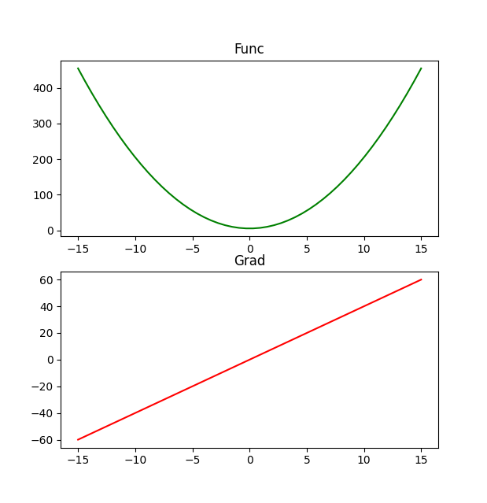

## 1D function derivation

Derivation of 1D function $2*x^2 + 5$ is determined for multiple $x$ values.   
The top graph represents the 1D function, while the bottom one is a derivation of the function.

### Running
Go to either dark or torch folder and run 'eval.py' to obtain results.