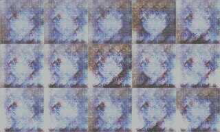

## Anime character generation using DCGAN

A dataset of around 21k samples is used to demonstrate DCGAN. 
The code is refactored version of a PyTorch tutorial available on: https://pytorch.org/tutorials/beginner/dcgan_faces_tutorial.html

The image below shows results from 1st to 15th epoch.   

### Running
Go to db folder and follow the instructions to download and process database.
Go to either dark or torch folder and run 'train.py' to obtain results. They should be similar albeit training with dark is slower on NVidia GeForce 4000 series significantly.