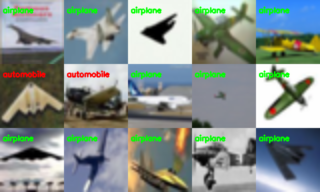

## CIFAR10 classification using CNN

A Resnet9 model is used to classify CIFAR10 dataset originally comprised of 10 classes. Here is used only 2 classes, to speedup the training procedure.
The obtained accuracy is about 95%.  

The image below shows samples of a validation dataset. Green and red text show predictions and the color denotes whether a sample is classified correctly or not.

### Running
Go to db folder and follow the instructions to download and process database.
Go to either dark or torch folder and run 'train.py' to obtain results. They should be similar.