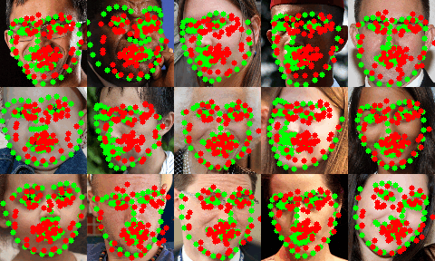

## Facial landmark regression

A Resnet18 model is emloyed to determine (regress) 68 facial keypoints.   
MSE is used as a loss.

The animated image below shows samples of a validation dataset over 15 epochs. 
Green dots (landmarks) represent ground truth labels, where red ones are predictions. 

### Running
Go to db folder and follow the instructions to download and process database.
Go to either dark or torch folder and run 'train.py' to obtain results. They should be similar.
Test script is also included.