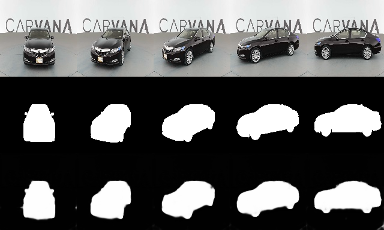

## Carvana (car segmentation) using UNet

Carvana image set is resized to 64x64 for faster training and inference.   
About one epoch is enough to see similar results as below, three is optimal.

### Running
Go to db folder and follow the instructions to download and process database.
Go to either dark or torch folder and run 'train.py' to obtain results. They should be similar.