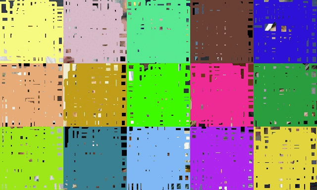

## Face detection using YOLO

Yolo v3 is used as a base, where backbone is replaced with a slim BlazeFace model used in media-pipe framework. Although the model is called BlazeFace, multiple class detection is possible.

The used database is far from ideal one, because images are cropped; however it enables fast training and the proof that the implementation works.

The image below shows progression of accuracy through epochs (7 total).

### Running
Go to db folder and follow the instructions to download and process database.
Go to either dark or torch folder and run 'train.py' to obtain results. They should be similar.

### How does it work ?
The implementation is a modified and refactored work from Aladin Persson with a replaced backbone.   
The full step-by-step implementation is available on Youtube (original backbone and non-refactored dataset implementation):
https://www.youtube.com/watch?v=Grir6TZbc1M

Some modifications were needed, especially on the loss function, since slicing must support backward operation as well - please compare torch and dark implementations for more.