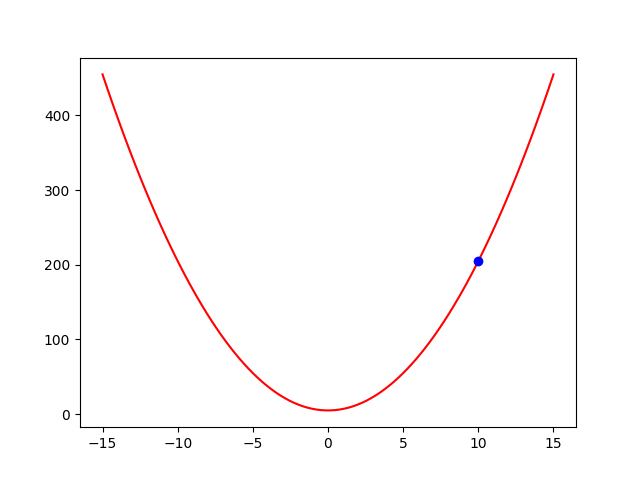
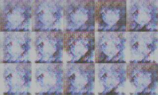

# Let's create mini PyTorch from scratch - Module 0

Have you ever wondered how PyTorch works in depth? If the answer is positive and you have a moderate knowledge of PyTorch (because we are going into depth), then this series of articles is for you.

We will start gently by introducing the concept of derivation, then move on to function optimization. From there, we will build our first neural network, followed by convolutional neural networks for classification, regression, segmentation, and image generation. Finally, we will conclude with object detection.

This series of articles is created to cover the building blocks of the famous PyTorch framework by following the principles presented here:

1) A moderate knowledge of PyTorch framework is assumed.   
2) Concepts are introduced step by step with samples.
3) The focus is placed on computer vision samples.
4) Significant effort is put on readable code - not on performance.
5) Existing articles and materials are reused (references and brief desciprtions) where possible to mittigate repetition.

## Content

Through this series of articles, we will build our mini version of PyTorch called **Dark** using only NumPy/CuPy. Here is a summary what you can expect in each of the eight modules.

<table>
    <tr>
        <td colspan="3" align="center"><b>Dark - 0</b> (this module)</td>
    </tr>
    <tr>
        <th>keywords</th>
        <td>derivation, gradient</td>
    </tr>
    <tr>
        <th>description</th>
        <td>Introduction of a fundamental construct - derivation, why is it imporant, and how derivative is taken from complex functions.</td>
    </tr>
    <tr>
        <th>Samples</th>
        <td>-</td>
    </tr>
</table>
 

<table>
    <tr>
        <td colspan="3" align="center"><b>Dark - 1</b></td>
    </tr>
    <tr>
        <th>keywords</th>
        <td colspan="2">execution graph, autodiff</td>
    </tr>
    <tr>
        <th>description</th>
        <td colspan="2">There will be two parts:  
a) We will extend the basis by taking a derivative of a complex function in a way PyTorch does it. For that we will introduce execution graph and autodiff.  
b) Finally, we will make out first framework for function minimization which supports scalars.</td>
    </tr>
    <tr>
        <th>Samples</th>
        <td width="50%" align="center">
            
             
            Func derivation
        </td>
        <td width="50%" align="center">
            
             
            Func minimization
        </td>
    </tr>
</table>

<table>
    <tr>
        <td colspan="3" align="center"><b>Dark - 2</b></td>
    </tr>
    <tr>
        <th>keywords</th>
        <td colspan="2">tensor, logistic regression, loss function</td>
    </tr>
    <tr>
        <th>description</th>
        <td colspan="2">The framework will be extended to work on multi dimensional arrays (tensors). We will conclude with logistic regression which will also introduce loss function.
        </td>
    </tr>
    <tr>
        <th>Sample</th>
        <td width="100%" align="center">
            
             
            Logistic regression on 2D data
        </td>
    </tr>
</table>

<table>
    <tr>
        <td colspan="3" align="center"><b>Dark - 3</b></td>
    </tr>
    <tr>
        <th>keywords</th>
        <td colspan="2">modules, Module class</td>
    </tr>
    <tr>
        <th>description</th>
        <td colspan="2">Logistic regression will be rewritten in a PyTorch style.   
        For that we need to introduce Module - a basic higher-order building block. Loss function and optimization algorithms will be placed into their respective places.  
        We will conclude with simple NN regression on 2D data and with MNIST classification using NN.
        </td>
    </tr>
    <tr>
        <th>Sample</th>
        <td width="50%" align="center">
            
             
            Fitting NN on 2D function
        </td>
        <td width="50%" align="center">
            
             
            Fashion MNIST classification
        </td>
    </tr>
</table>

<table>
    <tr>
        <td colspan="3" align="center"><b>Dark - 4</b></td>
    </tr>
    <tr>
        <th>keywords</th>
        <td colspan="2">Dataset, Dataloader and transformation classes</td>
    </tr>
    <tr>
        <th>description</th>
        <td colspan="2">In order for our models to work they need data.   
        Therefore, we will create Dataset - a class desribing how a single sample is loaded, Dataloader - a class resposible for data batching and transformation classes - for data augmentation.  
        We will have our first sample written in PyTorch style - FashionMNIST classification.
        </td>
    </tr>
    <tr>
        <th>Sample</th>
        <td width="100%" align="center">
            
             
            Fashion MNIST classification - in PyTorch style!
        </td>
    </tr>
</table>

<table>
    <tr>
        <td colspan="3" align="center"><b>Dark - 5</b></td>
    </tr>
    <tr>
        <th>keywords</th>
        <td colspan="2">GPU, convolution, max pooling, ResNet</td>
    </tr>
    <tr>
        <th>description</th>
        <td colspan="2">In order to speed up the calculation we will implement support for GPU via CuPy.     
        To work with images we will briefly explain and implement convolution and max pooling layers (for CPU and GPU).  
        Finally, ResNet based classification and regression sample will follow.
        </td>
    </tr>
    <tr>
        <th>Samples</th>
        <td width="50%" align="center">
            
             
            CIFAR classification using ResNet
        </td>
        <td width="50%" align="center">
            
             
            Face landmark localization (regression) using ResNet
        </td>
    </tr>
</table>

<table>
    <tr>
        <td colspan="3" align="center"><b>Dark - 6</b></td>
    </tr>
    <tr>
        <th>keywords</th>
        <td colspan="2">transposed convolution, upsampling layers; UNet; GAN</td>
    </tr>
    <tr>
        <th>description</th>
        <td colspan="2">Image to image translation (e.g. autoencoders) require image upsampling opposed to convolution and max-pooling which usually reduce image size. Therefore, transposed convolution and upsample layers will be introduced.  
        Deomnstration will be made by UNet-based car segmentation and anime generation via GAN.
        </td>
    </tr>
    <tr>
        <th>Samples</th>
        <td width="50%" align="center">
            
             
            Anime generation using GAN
        </td>
        <td width="50%" align="center">
            
             
            Car segmentation using UNet
        </td>
    </tr>
</table>

<table>
    <tr>
        <td colspan="3" align="center"><b>Dark - 7</b></td>
    </tr>
    <tr>
        <th>keywords</th>
        <td colspan="2">object detection, YOLO</td>
    </tr>
    <tr>
        <th>description</th>
        <td colspan="2">In order to show we support SOTA algorithms, a object detection algorithm - YOLO will be created from scratch with a custom backbone for face detection.
        </td>
    </tr>
    <tr>
        <th>Sample</th>
        <td width="100%" align="center">
            
             
            Training YOLO face detection (epochs 1-15)
        </td>
    </tr>
</table>

## Function optimization
Imagine you are on a 1D mountain and you want to go to a walley. You do not see anything because you are blindfolded. How would you do that?

You would step into one direction (e.g. left), and then, if you stepped onto higher ground, you would move in the opposite direction. Notice that even if you stepped onto a lower level you would still require to check the other side (e.g. right) to ensure the steepest path. In other words you would require two evaluations: the left and the right one. 

Now imagine you are on a 2D plane with the same problem. How many evaulations would you have now? The answer is 4 (left, right, top, bottom).
Functions being optimized have high dimensions. So for $N$ dimensional function, you would require $N * 2$ evaluations for a single movement in the right direction.

You would repeat that step multiple times until the local-minima is reached. If we do not want to miss a local minima, we would usually make smaller steps - by some factor.
We can formulate this as an algorithm:

1) Make a forward-backward step for each dimension.
2) Calculate absolute difference $\Delta$ between forward-backward step for each dimension.
3) Update current position: p = p - $\Delta * \alpha$ where $\alpha$ is a factor which tells us how fast we are heading toward the minima (not to skip one).

Let us assume we have the following function: $y = 2x^2 + 5$.
The following animation shows our current position in each step and how we approach the minima:

This is analogous to what a PyTorch does, where we would replace steps 1) and 2) with *zero grad* and *backward* functions and the step 3) with *optimize* function.

## Why gradient based approach
The current problem is the number of steps required to calculate the next movement.
The current algortihm (called hill climbing / decent) has to make $2N$ calculations where $N$ is a number of dimensions. Each function we evaulate is treated as a black box, which means we have to evaluate the entire function for each changed dimension.

If we relax conditions just a bit - specifically, that is if we know what a function is (different from its evualtion on an entire space!) and if the function is "smooth enough" - then we can calculate a direction where we move in a single step (for each dimension).
That speeds up the process $2N$ times (because we do not treat out function as a black box anymore)!  

Let us introduce derivation.
If we take a very small step and assuming the above, then we have a formal definition of a derivation: 

$f^{'}(x) = lim_{h \rightarrow 0} \frac{f(x_0 + h) - f(x_0)}{h}$

### Sample - derivation of a $x^2$ using limit (optional)
If someone is interested, here we show how to derive the following function: $y = f(x) = x^2$ using the derivation definition:
$$\begin{aligned}\frac{dy}{dx} = \\
lim_{h \rightarrow 0} \frac{f(x + h) - f(x)}{h} = \\
lim_{h \rightarrow 0} \frac{(x + h)^2 - x^2}{h} = \\
lim_{h \rightarrow 0} \frac{x^2 + h^2 + 2xh - x^2}{h} = \\ 
lim_{h \rightarrow 0} \frac{h^2 + 2xh - x^2 + x^2}{h} = \\ 
lim_{h \rightarrow 0} \frac{h(h + 2x + 0)}{h} = \\
lim_{h \rightarrow 0} \frac{h(h + 2x)}{h} = \\
lim_{h \rightarrow 0} (h + 2x) = \\
2x \end{aligned}$$

### Derivation of complex functions
If we take our function: $y = 2*x^2 + 5$. It derivation is $\frac{dy}{dx} = 2 * (2 * x^1) + 0 = 4*x$, also shown in the graph below:   

Here, we used multiple derivation rules [1] for mulitiplication, addition and power (which we derived in the previous paragprah using the definition of derivation).

In general, we will have complex functions and it is beneficial if we know how to derive simple elements; then, we also know how to derive the entire function (e.g. ML model with its loss). The rule is called the **chain rule**.   
It states that if we have a complex function such as: $(lnx)^2$, we can replace inner expression $lnx$ with a single element - e.g. $u$, derive the function $\frac{d(u)^2}{du} = 2u$ and then its replaced part $\frac{d(lnx)}{dx} = \frac{1}{x}$. Finally, we mulply all the elements: $2 * u = 2 * \frac{1}{x} = \frac{2}{x}$. In theory, we can have multiple substitutions. The rule can formally be written as:

$$\begin{aligned}
\frac{dy}{dx} = \frac{dy}{du} \frac{du}{dx}
\end{aligned}$$

In general, we will compute derivative of our most inner function and propagate it to outer functions, which will just multiply its derivative with the received one and continue the propagation.

## Remarks 
We began our journey by giving a brief overlook of what is comming next. Here, we delved into the most fundamental concept - derivation - exploring the idea behind it and why it is being used. Next, let us see how PyTorch applies it in practice. 

All images, if not explicitly written, are created and are the property of the author.

### Source code
All the source code with docs is available on [Github](https://github.com/dajuric/dark).    
Let us connect: [LinkedIn](https://www.linkedin.com/in/darko-juric/).

## References
[1] https://www.mathsisfun.com/calculus/derivatives-rules.html