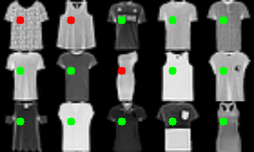
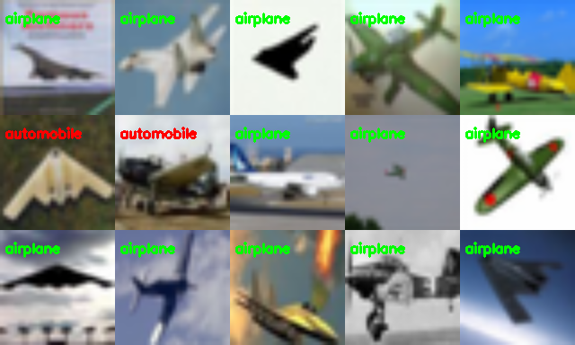
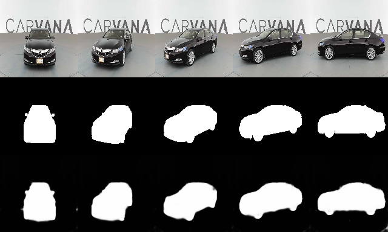

# Let's create mini PyTorch from scratch - Module 0

Have you ever wondered how PyTorch works in depth ? If the answer is positive and you have a moderate knolwedge of PyTorch (because we are going into depth), then this series of articles is for you. 

We will start gentlly, by introducing a concept of derivation, then move onto function optimization. From that we will build our first neural network, then convolutional neural networks (classification, regression, segmentation and generation) and finish with object detection. 

This series of articles is created in order to cover building blocks of a famous PyTorch framework by following prinicples presented here:
1) a moderate knowledge of PyTorch framework is assumed   
2) concepts are introduced step by step with samples
3) a focus is placed on computer vision samples
4) a significant effort is put on readable code not on performance
5) existing articles and materials are reused (references and brief desciprtions) where possible to mittigate repetition

## Content

<table>
    <tr>
        <td colspan="3" align="center"><b>Dark - 0</b> (this module)</td>
    </tr>
    <tr>
        <th>keywords</th>
        <td>derivation</td>
    </tr>
    <tr>
        <th>description</th>
        <td>We will start gently, by introducing fundamental construct - derivation, why is it imporant, and how derivative is taken from complex functions.</td>
    </tr>
    <tr>
        <th>Samples</th>
        <td>-</td>
    </tr>
</table>
 

<table>
    <tr>
        <td colspan="3" align="center"><b>Dark - 1</b></td>
    </tr>
    <tr>
        <th>keywords</th>
        <td colspan="2">execution graph, autodiff</td>
    </tr>
    <tr>
        <th>description</th>
        <td colspan="2">There will be two parts:  
a) We will extend the knowledge by taking a derivative of a complex function in a way PyTorch does it. For that we will introduce execution graph and autodiff.  
b) Finally, we will make out first framework for function minimization which supports scalars.</td>
    </tr>
    <tr>
        <th>Samples</th>
        <td width="50%" align="center">
            
             
            Func derivation
        </td>
        <td width="50%" align="center">
            
             
            Func minimization
        </td>
    </tr>
</table>

<table>
    <tr>
        <td colspan="3" align="center"><b>Dark - 2</b></td>
    </tr>
    <tr>
        <th>keywords</th>
        <td colspan="2">tensor, logistic regression, loss function</td>
    </tr>
    <tr>
        <th>description</th>
        <td colspan="2">The framework will be extended to work on multi dimensional arrays (tensors). We will conclude with logistic regression which will also introduce loss function.
        </td>
    </tr>
    <tr>
        <th>Sample</th>
        <td width="100%" align="center">
            
             
            Logistic regression on 2D data
        </td>
    </tr>
</table>

<table>
    <tr>
        <td colspan="3" align="center"><b>Dark - 3</b></td>
    </tr>
    <tr>
        <th>keywords</th>
        <td colspan="2">modules, Module class</td>
    </tr>
    <tr>
        <th>description</th>
        <td colspan="2">Logistic regression will be rewritten in  a PyTorch style.   
        For that we need to introduce Module - a basic higher-order building block. Loss function and optimization algorithm will be placed into their respective places.  
        We will conclude with simple NN regression on 2D data and with MNIST classification using NN.
        </td>
    </tr>
    <tr>
        <th>Sample</th>
        <td width="50%" align="center">
            
             
            Fitting NN on 2D function
        </td>
        <td width="50%" align="center">
            
             
            Fashion MNIST classification
        </td>
    </tr>
</table>

<table>
    <tr>
        <td colspan="3" align="center"><b>Dark - 4</b></td>
    </tr>
    <tr>
        <th>keywords</th>
        <td colspan="2">Dataset, Dataloader and transformation classes</td>
    </tr>
    <tr>
        <th>description</th>
        <td colspan="2">In order for our models to work they need data.   
        Therefore, we will create Dataset - a class desribing how a single sample is loaded, Dataloader - a class resposible for data batching and transformation classes - for data augmentation.  
        We will have our first sample written in PyTorch style - FashionMNIST classification.
        </td>
    </tr>
    <tr>
        <th>Sample</th>
        <td width="100%" align="center">
            
             
            Fashion MNIST classification - in PyTorch style!
        </td>
    </tr>
</table>

<table>
    <tr>
        <td colspan="3" align="center"><b>Dark - 5</b></td>
    </tr>
    <tr>
        <th>keywords</th>
        <td colspan="2">convolution, max pooling, ResNet</td>
    </tr>
    <tr>
        <th>description</th>
        <td colspan="2">In order to speed up the calculation we will implement support for GPU via CuPy.     
        To work with images we will briefly explain and implement convolution and max pooling layers (for CPU and GPU).  
        Finally, ResNet based classification and regression sample will follow.
        </td>
    </tr>
    <tr>
        <th>Samples</th>
        <td width="50%" align="center">
            
             
            CIFAR classification using ResNet
        </td>
        <td width="50%" align="center">
            
             
            Face landmark localization (regression) using ResNet
        </td>
    </tr>
</table>

<table>
    <tr>
        <td colspan="3" align="center"><b>Dark - 6</b></td>
    </tr>
    <tr>
        <th>keywords</th>
        <td colspan="2">transposed convolution, upsampling layers; UNet; GAN</td>
    </tr>
    <tr>
        <th>description</th>
        <td colspan="2">Image to image translation (e.g. autoencoders) require image upsampling opposed to convolution and max-pooling which usually reduce image size. Therefore, transposed convolution and upsample layers will be introduced.  
        Deomnstration will be made by UNet-based car segmentation and anime generation via GAN.
        </td>
    </tr>
    <tr>
        <th>Samples</th>
        <td width="50%" align="center">
            
             
            Anime generation using GAN
        </td>
        <td width="50%" align="center">
            
             
            Car segmentation using UNet
        </td>
    </tr>
</table>

<table>
    <tr>
        <td colspan="3" align="center"><b>Dark - 7</b></td>
    </tr>
    <tr>
        <th>keywords</th>
        <td colspan="2">object detection, YOLO</td>
    </tr>
    <tr>
        <th>description</th>
        <td colspan="2">In order to show we did an excellent job, a object detection algorithm - YOLO will be created from scratch with a custom backbone for face detection.
        </td>
    </tr>
    <tr>
        <th>Sample</th>
        <td width="100%" align="center">
            
             
            Training YOLO face detection (epochs 1-15)
        </td>
    </tr>
</table>

## Function optimization

We can think about PyTorch as a function optimization framework built on tensors. Tensors in PyTorch are nothing more than multidimensional arrays which have an ability to be connected to each other in a form of a graph. By having an execution graph we can propagate gradients backward.

## Why gradient based approach
Imagine you are on a 1D mountain and you want to go to a walley. YOu do not see anything because you are blindfolded. How would you do that?

You would step into one direction (e.g. left), and then if you stepped onto a higher ground you would move into the opposite direction. However, if you stepped onto a lower level you would still require to check the other side (e.g. right) to ensure the steepest path.  
In other words you would require two evaluations: the left and the right one.

Now imagine you are on a 2D plane with the same problem. How many evaulations would you have now ? The answer is 4 (left, right, top, bottom).

Unfortunatelly, functions being optimized have high dimensions. So for $N$ dimensioned function you would require $N * 2$ evaluations.

But what if someone gave you a for each position you are a direction where to go (vector) and not only that, but big of a step you need to have to reach new optimum. It would be a whole lot faster - let us introduce derivation.

## Derivation - definition and sample

If we relax condistions just a bit, that is if we know what a function is (different from its evualtion on an entire space!) and if the function is "smooth enough" then we can calculate a direction where we move in a single step! 

If we take a very small step and assuming the above, then we have a formal definition of a derivation: 

$f^{'}(x) = lim_{h \rightarrow 0} \frac{f(x_0 + h) - f(x_0)}{h}$

if $y = f(x) = x^2$ 
$$\begin{aligned}\frac{dy}{dx} = \\
lim_{h \rightarrow 0} \frac{f(x + h) - f(x)}{h} = \\
lim_{h \rightarrow 0} \frac{(x + h)^2 - x^2}{h} = \\
lim_{h \rightarrow 0} \frac{x^2 + h^2 + 2xh - x^2}{h} = \\ 
lim_{h \rightarrow 0} \frac{h^2 + 2xh - x^2 + x^2}{h} = \\ 
lim_{h \rightarrow 0} \frac{h(h + 2x + 0)}{h} = \\
lim_{h \rightarrow 0} \frac{h(h + 2x)}{h} = \\
lim_{h \rightarrow 0} (h + 2x) = \\
2x \end{aligned}$$

$y = 2*x^2 + 5$   
$\frac{dy}{dx} = 2 * (2 * x^1) + 0 = 4*x$

## Remarks 