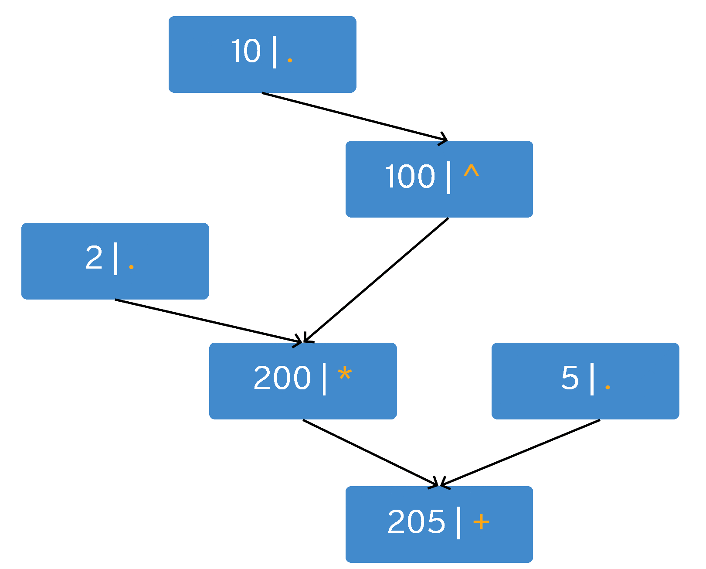
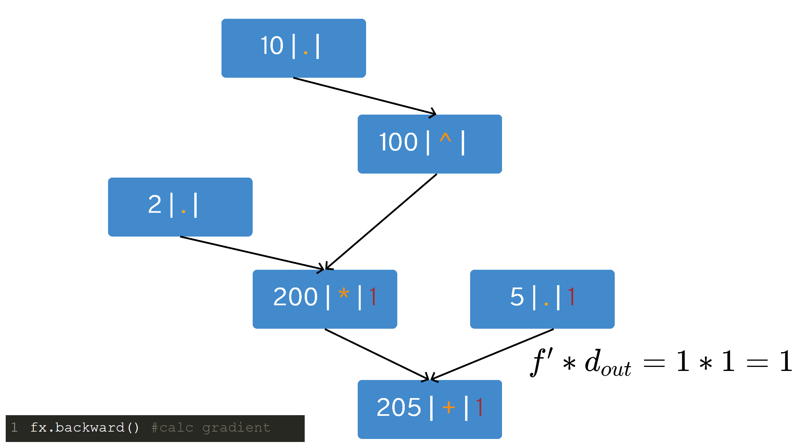
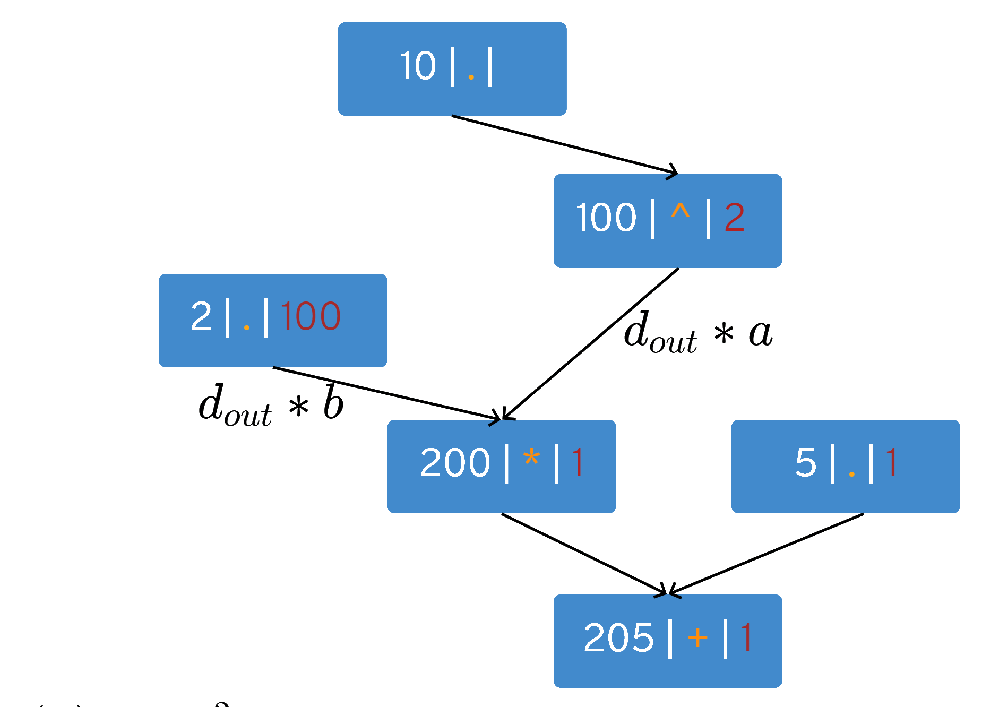
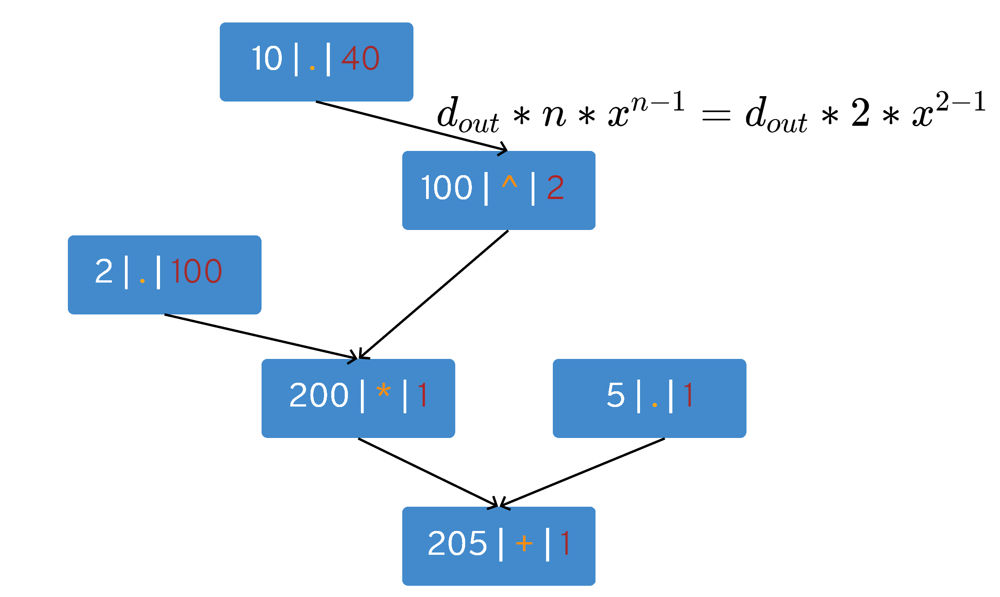
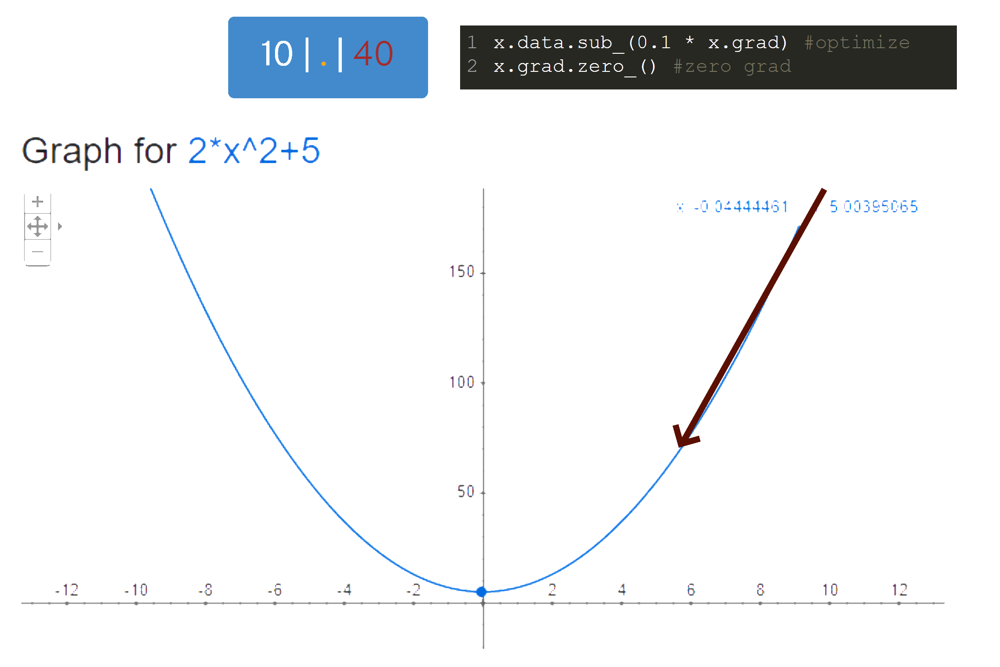

# Let's create mini PyTorch from scratch - Module 1 (1/2)

Have you ever wondered how PyTorch works in depth ? If the answer is positive and you know some PyTorch basics than this article (actually series) is for you.

Do not worry too much if you do not understand concepts mentioned here like *graph* or *autodiff* - you will by reading this article. Also, going through basic module of PyTorch is recommended.

We can think about PyTorch as an function optimization framework built on tensors. Tensors in PyTorch are nothing more than multidimensional arrays which have an ability to be connected to each other in a form of a graph. By having an execution graph we can propagate gradients backward.

In this tutorial we will explain in depth how and why graph is built, derivatives calculated and propagated backwards as well how an optimization works.

## Sample

Let us write a basic sample in PyTorch that uses automatic differentiation and optimization mechanism - finding minimum of a 1D function quadratic function:

```python
import torch

x = torch.tensor([10.0], requires_grad=True)

for _ in range(100):
     fx = torch.add(torch.mul(2, torch.pow(x, 2)), 5) #2*x^2 + 5
     fx.backward() #calc gradient

     x.data.sub_(0.1 * x.grad) #optimize
     x.grad.zero_() #zero grad
     
print(x) #0
```

## So what is going on there ?

The sample above has three important parts:
1) objective to optimize - quadratic function
2) gradient calculation
3) optimization

Users of PyTorch will notice the three most important functions: 
1) backward()
2) optim step() - written as ```value = value - <learning rate> * x.grad```
3) zero_grad()

First, we set our parameter: $x$ (in our case it has a concrete value of 10).
As the variable $x$ is the only variable that will be optimized, it is wrapped into tensor object. 
Moreover, all operations that are used are from the torch namespace (we can not mix 3rdParty ones with torch ones). The reason behind is that we have to trace variable $x$ to build a graph. 

### What kind of graph are we talking about ?

We are talking  about auto diff graph. 
Let us decompose the function: $f(x) = 2 * x^2 + 5$, for some concrete values e.g. $x = 10$. Each node will display two elements: a value and an operation if a node carries an operation where '.' will signify no operation.



From top down: the input value is 10. The node has no operation. This number is an input to a node which has power of 2 operation and it is displayed in the second row.
Next, in the third row constant 2 enters into play which is multiplied with the previous node - fourth row. Finally, constant 5 is added to everything which creates final node where 205 is shown.

### Going backwards - function 'backward'

According to chain rule $d * f'(x)$, where $d$ is an input from a child node, we can traverse the directed graph backwards to calculate derivatives. Let us show this by using the previous graph and extending it by the third element: a derivation value.


The final node (in the last row) always has derivation value set to 1. The node has an addition operation $x+y$.
Taking partial derivation respective to $x$ we obtain 1 $(\frac{d(x+y)}{dx} = 1 + 0 = 1)$ and using the chain rule the left parent node will have value $1 * 1 = 1$. The same goes fo the right parent node.



Next, we have multiplication operation $x*y$. Taking derivative in respect to $x$ we have $y$ $(\frac{d(x*y)}{dx} = y)$, while taking derivative in respect to $y$ we obtain $x$, where $x$ and $y$ were input values into the node (2, and 100 respectively). 

Therefore, the parent node on the left receives value $d * y = 1 * 100 = 100$ and the right parent receives $d * x = 1 * 2 = 2$. [TODO - replace a and b with x and y]



The node is the second row has power function which derivative is $(x^2)' = 2 * x$. Therefore to its only parent is sends $d * (2 * x) = 2 * (2 * 10) = 40$ which is the final result.



As it can be seen, by using partial derivatives for simple functions and using the chain rule we can differentiate complex functions automatically.


### Optimization step - function 'optimize'

After obtaining a gradient value (in our case 40), we can move parameters $x$ towards the function minimum. We do that simply by moving to the opposite direction ('-' sign) of a gradient by a fraction (here 0.1) of its value. 



```python
 x.value = x.value - 0.1 * x.grad
```

The next value of $x$ is $10 - 0.1 * 40 = 6$. 

After an optimization step we do not need the gradient anymore and we do not want to accumulate values from previous steps, so we clear all the gradients in all nodes by calling ```zero_grad()```.

Finally, by repeating this procedure many times (in this case 100) we are moving our parameter ($x$) towards the function minimum - in this case 0.


## Remarks and Final Thoughts
All images used in this article are made by the author. 

I hope you have learned something new and stay tuned for the next tutorial where we are going to write an actual implementation of an auto-diff engine.

---
TODO: ispraviti a,b -> x, y
zaokružiti polja koja se trenutno gledaju na grafu